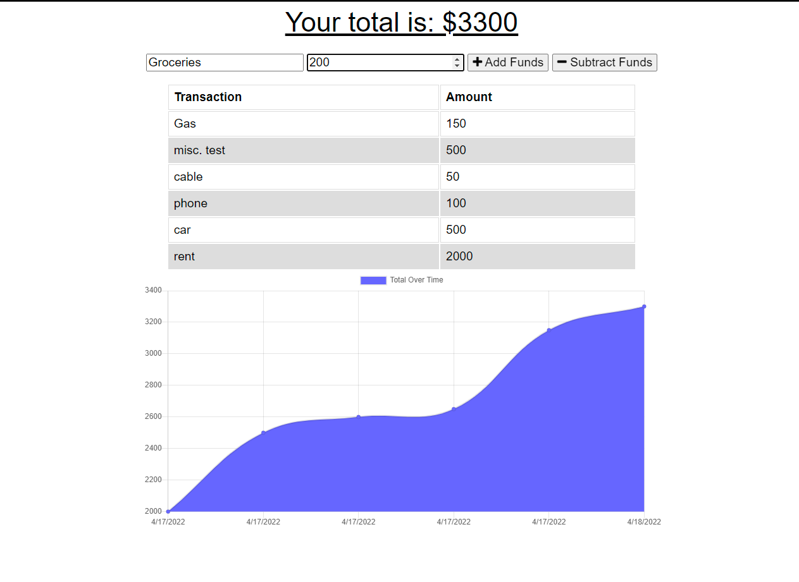
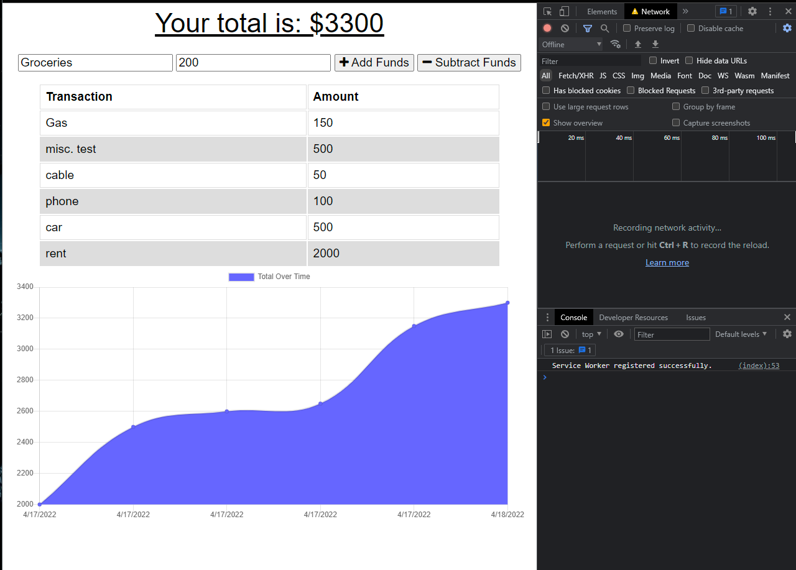
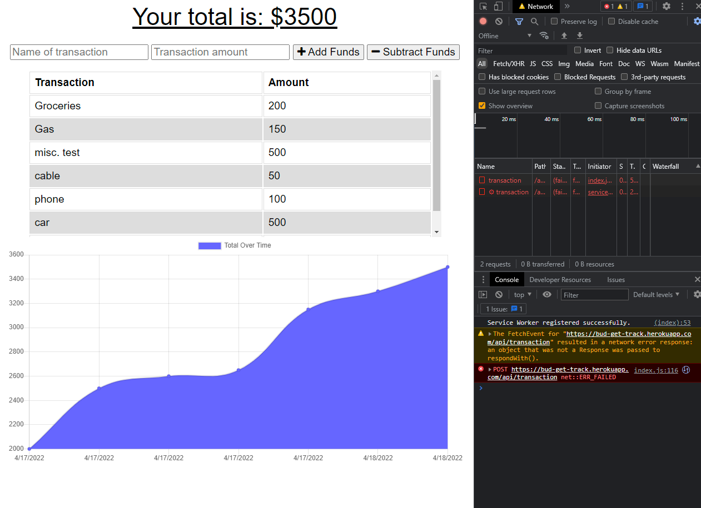
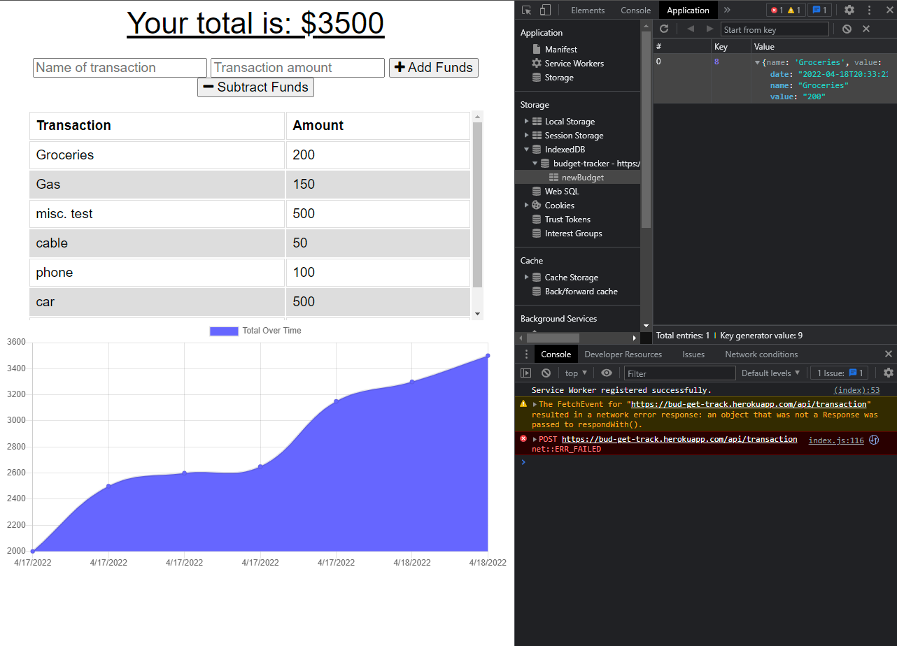
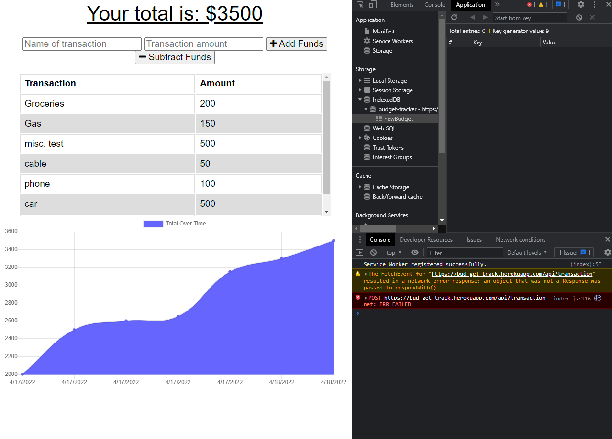
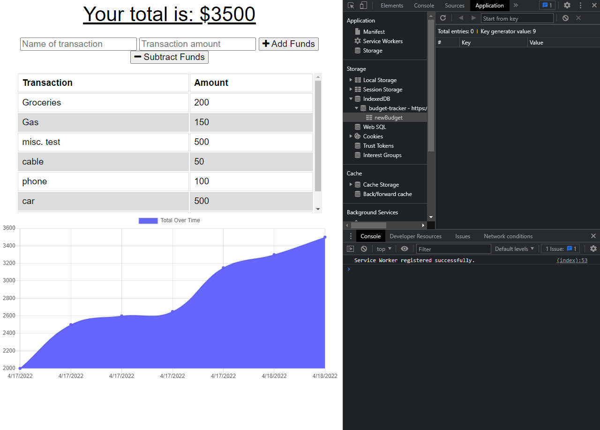

# The Budget Master
 

 

---
 
 

## User Story

- AS AN avid traveler
I WANT to be able to track my withdrawals and deposits with or without a data/internet connection
SO THAT my account balance is accurate when I am traveling 

 

---
 
 

## Acceptance Criteria

GIVEN a budget tracker without an internet connection
WHEN the user inputs an expense or deposit
THEN they will receive a notification that they have added an expense or deposit
WHEN the user reestablishes an internet connection
THEN the deposits or expenses added while they were offline are added to their transaction history and their totals are updated

 

---
 
 

## Description:
The Budget Master was created as a financial aid to assist users in tracking their finances. The app allows users to add expenses and credits to their budget. The app employs PWA functionality and allows users track and modify their budget from any location regardless of network connection issues. The app has the ability to store user input offline in the event of a network failure and push to the online database once the connection is restored. The front end of the app is deployed on heroku while the backend uses mongodb atlas.

 

---
 
 

## Usage and Installation

- The app is deployed on heroku and does not require any installation procedures for use. Usage is simple, a description of the entry and value are required to post to an entry to the database.

- The app is deployed at the link below:
- https://bud-get-track.herokuapp.com/

---

## Screenshots

 

 

 

 

 

 

---

## Links

Github Repository:

 - https://github.com/Vithursan6/budget-tracker

Deployed Application:

- https://bud-get-track.herokuapp.com/
 

---
 
 

## License

MIT License

Copyright (c) 2022 Vithursan6

Permission is hereby granted, free of charge, to any person obtaining a copy
of this software and associated documentation files (the "Software"), to deal
in the Software without restriction, including without limitation the rights
to use, copy, modify, merge, publish, distribute, sublicense, and/or sell
copies of the Software, and to permit persons to whom the Software is
furnished to do so, subject to the following conditions:

The above copyright notice and this permission notice shall be included in all
copies or substantial portions of the Software.

THE SOFTWARE IS PROVIDED "AS IS", WITHOUT WARRANTY OF ANY KIND, EXPRESS OR
IMPLIED, INCLUDING BUT NOT LIMITED TO THE WARRANTIES OF MERCHANTABILITY,
FITNESS FOR A PARTICULAR PURPOSE AND NONINFRINGEMENT. IN NO EVENT SHALL THE
AUTHORS OR COPYRIGHT HOLDERS BE LIABLE FOR ANY CLAIM, DAMAGES OR OTHER
LIABILITY, WHETHER IN AN ACTION OF CONTRACT, TORT OR OTHERWISE, ARISING FROM,
OUT OF OR IN CONNECTION WITH THE SOFTWARE OR THE USE OR OTHER DEALINGS IN THE
SOFTWARE.
 

---

## Author

Vithursan6

GITHUB - https://github.com/Vithursan6

